# IDPhotoReady

A program that checks if a photo is suitable for use on an ID document.

English | [繁體中文](README.zh-TW.md)


<details open>
<summary><strong>Testing Result</strong></summary>

|                                                    Image                                                     |                                                   Image                                                    |                                                   Image                                                    |                                                    Image                                                     |
| :----------------------------------------------------------------------------------------------------------: | :--------------------------------------------------------------------------------------------------------: | :--------------------------------------------------------------------------------------------------------: | :----------------------------------------------------------------------------------------------------------: |
|            <div align="center">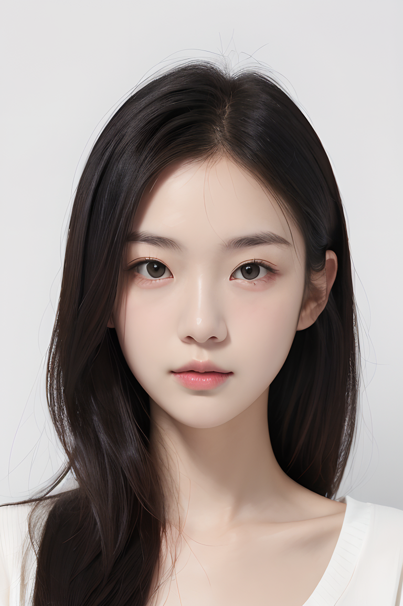<br>Result: ✅</div>            |           <div align="center"><br>Result: ✅</div>           |           <div align="center">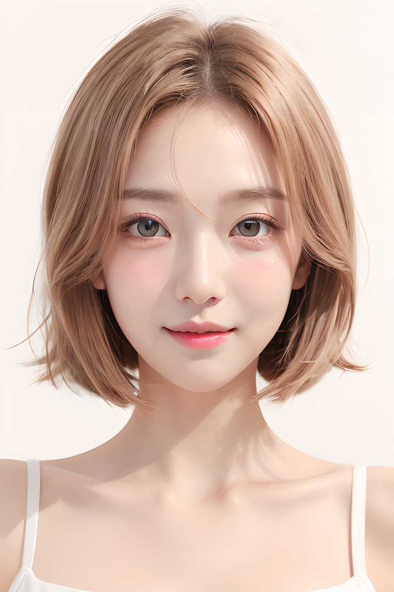<br>Result: ✅</div>           |            <div align="center">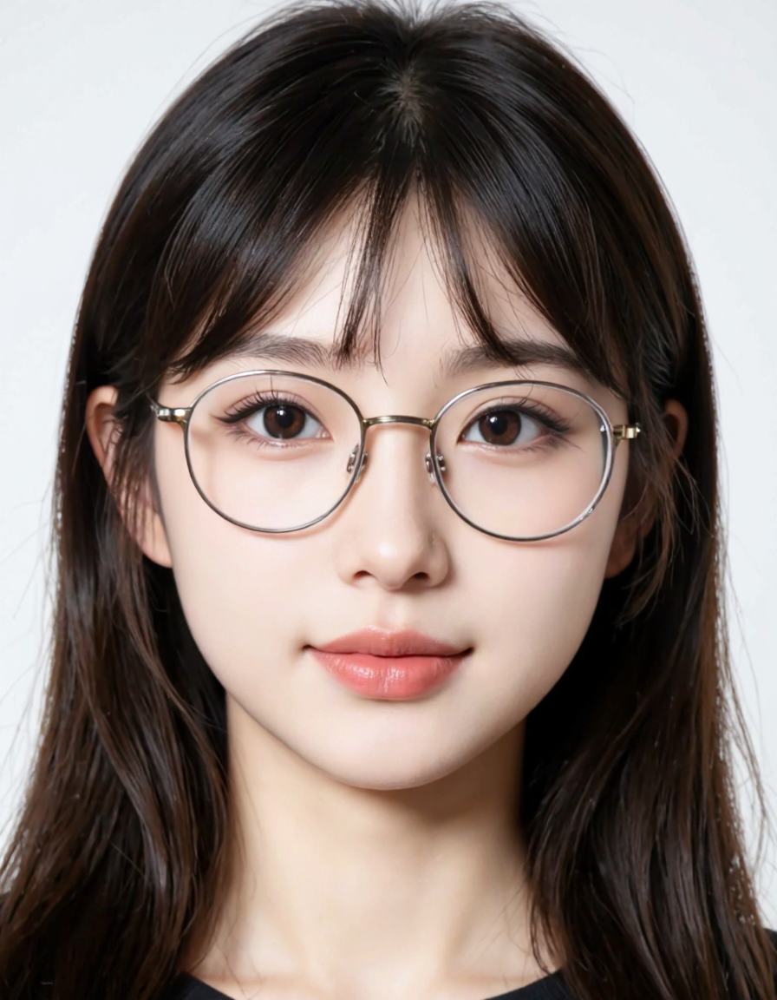<br>Result: ✅</div>            |
|            <div align="center">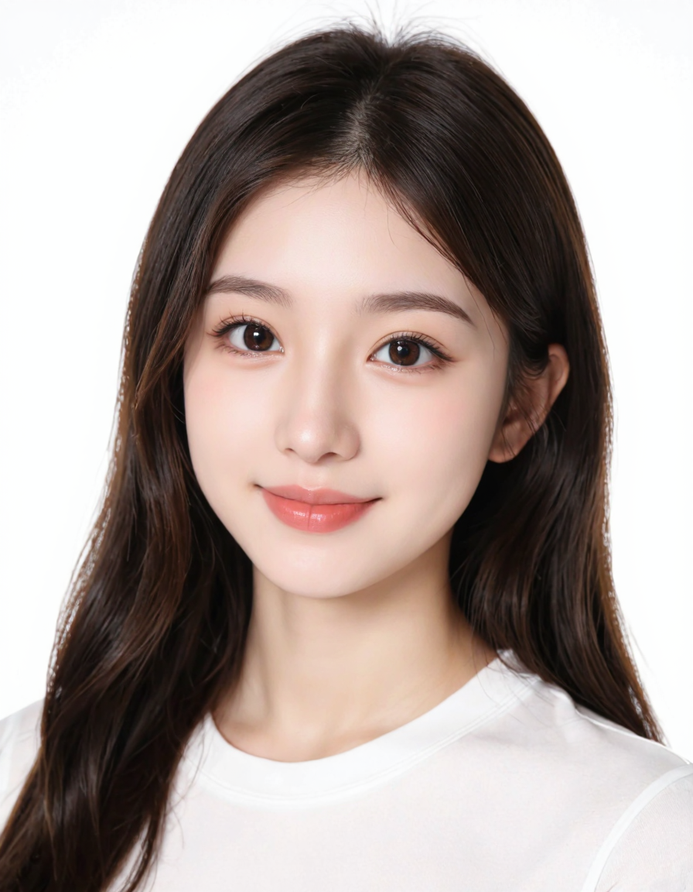<br>Result: ✅</div>            |           <div align="center">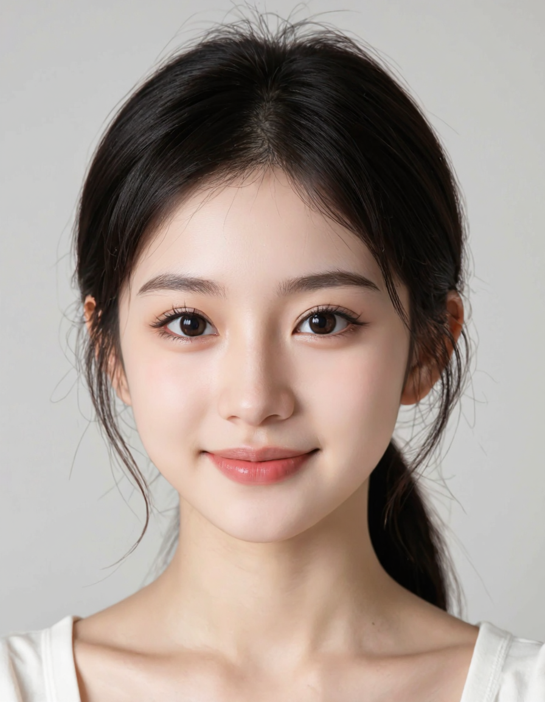<br>Result: ✅</div>           |           <div align="center">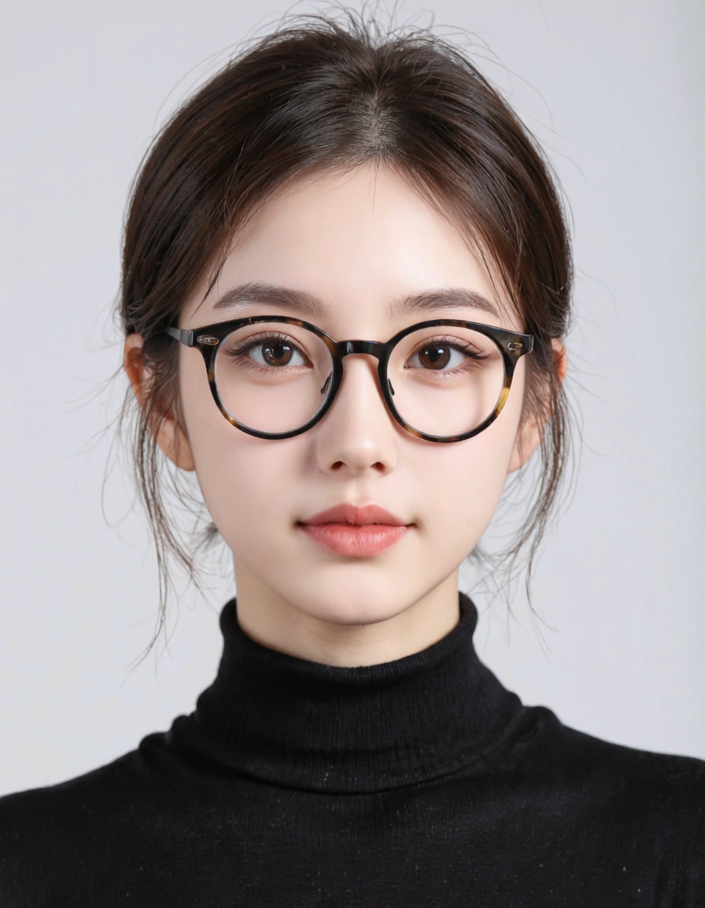<br>Result: ✅</div>           | <div align="center">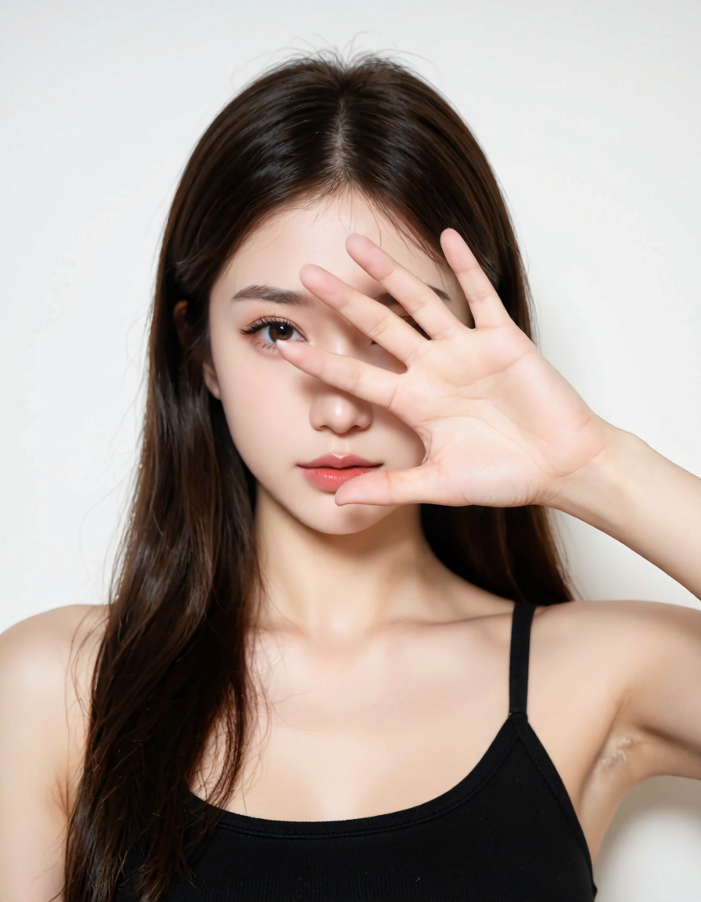<br>Result: ❌(Face Covered by hand)</div> |
| <div align="center"><br>Result: ❌(Face Covered by hand)</div> | <div align="center"><br>Result: ❌(Not facing forward)</div> | <div align="center"><br>Result: ❌(Not facing forward)</div> |       <div align="center">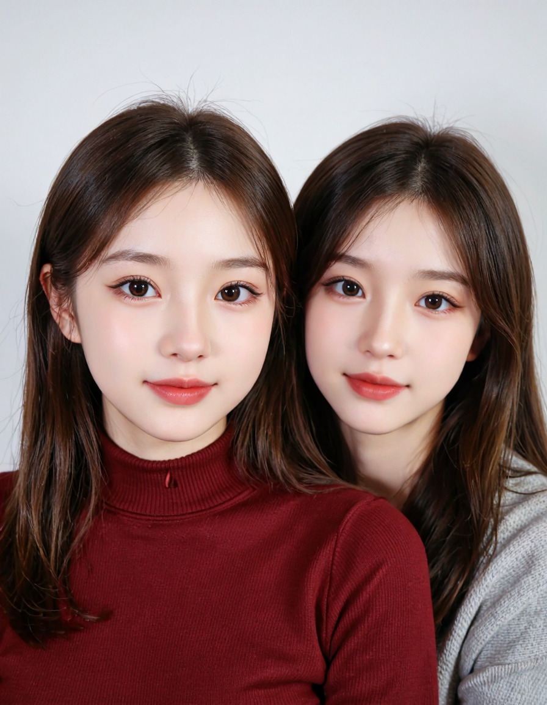<br>Result: ❌(2 Faces)</div>        |
|  <div align="center">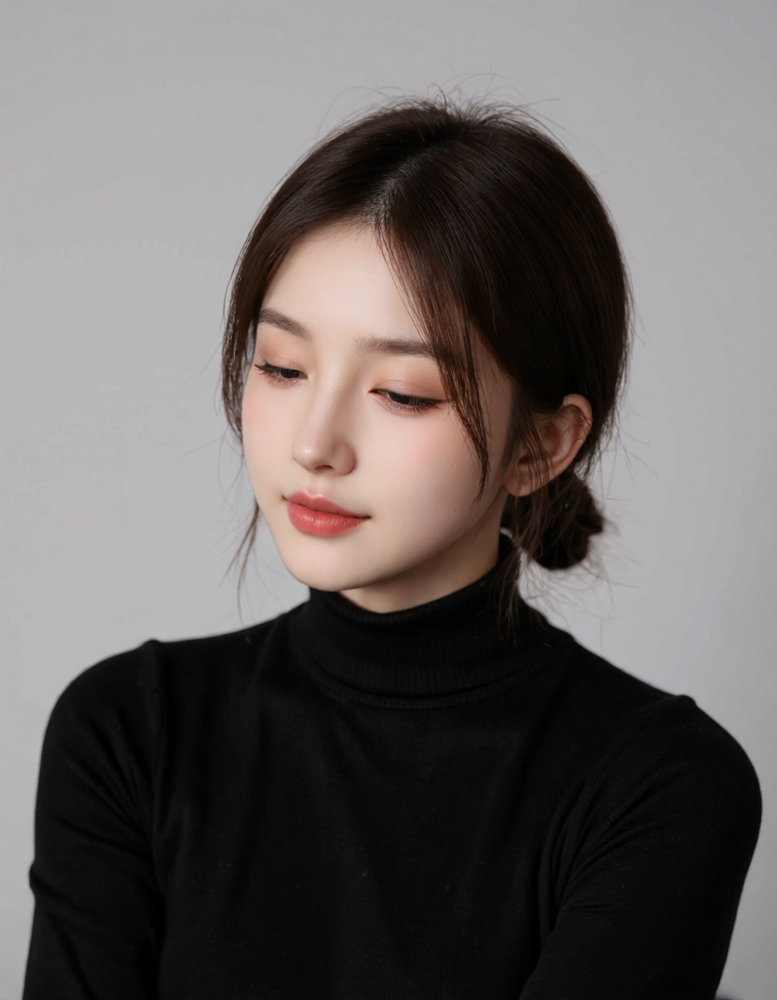<br>Result: ❌(Not facing forward)</div>  |      <div align="center">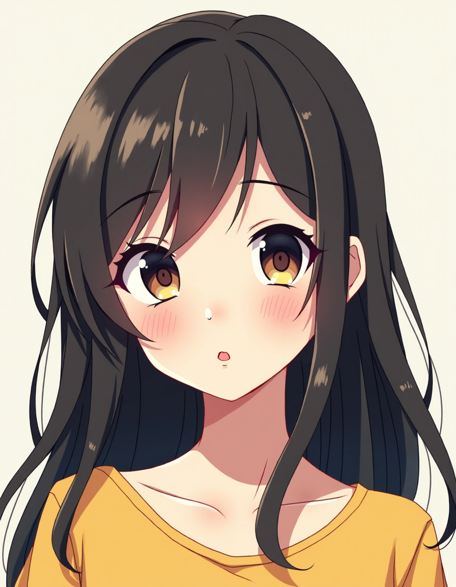<br>Result: ❌(No face)</div>       |      <div align="center">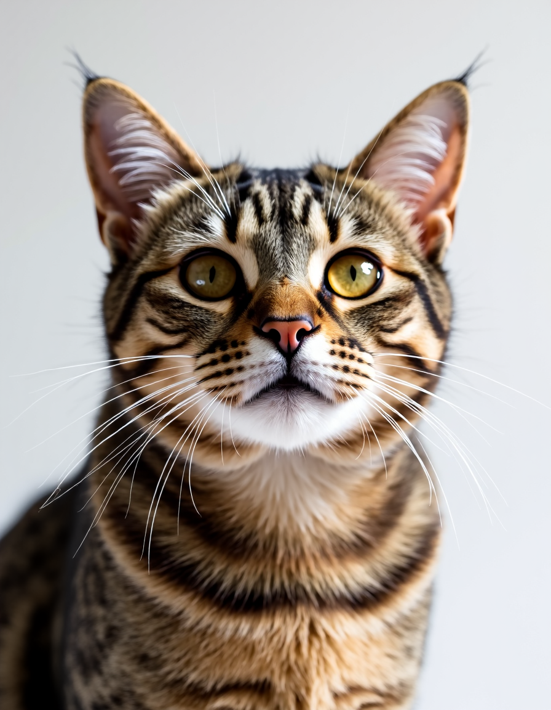<br>Result: ❌(No face)</div>       |                                                                                                              |

</details>

## 📋 Table of Contents

- [Key Features](#✨-key-features)
- [Installation](#⚙️-installation)
- [Usage](#🚀-usage)
  - [Web GUI](#🖥️-web-gui)
  - [REST API](#🔌-rest-api)
- [Validation Options](#✔️-validation-options)
- [Configuration & Tuning](#🔧-configuration--tuning)
- [Project Structure](#📂-project-structure)
- [Troubleshooting](#🚑-troubleshooting)
- [License](#📄-license)

## ✨ Key Features

- **🖥️ Dual Interface:** A user-friendly **Web GUI** for easy uploads and a **REST API** for system integration.
- **✅ Flexible Validation:** Checks for face position, eye state (open/closed), obstructions, background uniformity, shoulder balance, and image quality.
- **🖼️ Annotated Results:** Provides clear visual feedback on the image, highlighting detected landmarks and specific validation failures.
- **🚀 Built with Power:** Leverages **OpenCV**, **MediaPipe**, and **scikit-learn** for accurate and reliable analysis.

## ⚙️ Installation

A virtual environment is recommended.

```bash
# 1. Clone the repository
git clone https://github.com/askiichan/IDPhotoReady.git
cd IDPhotoReady

# 2. Create and activate a virtual environment
# On Windows
python -m venv venv
venv\Scripts\activate

# On macOS / Linux
python3 -m venv venv
source venv/bin/activate

# 3. Install dependencies
pip install -r requirements.txt
```

The required AI models will be downloaded automatically on first run. For manual downloads, see [Troubleshooting](#🚑-troubleshooting).

## 🚀 Usage

You can run this project as a self-contained web application or as a backend API.

### 🖥️ Web GUI

The easiest way to get started. Ideal for validating single photos or batches.

1.  **Start the application:**
    ```bash
    python main.py
    ```
2.  **Open your browser** and navigate to the local URL shown in the terminal (usually `http://127.0.0.1:7860`).

_The interface provides detailed failure reasons and an annotated image._

### 🔌 REST API

For programmatic access and integration with other services.

1.  **Start the API server:**
    ```bash
    python start_api.py
    ```
2.  **Access the interactive documentation** in your browser at `http://localhost:8000/docs`. You can test all endpoints directly from this page.

#### API Endpoints

- `POST /validate`: Upload an image file for validation.
- `POST /validate-base64`: Submit a base64-encoded image string.
- `GET /health`: Check if the API is running.

#### Example: cURL

```bash
curl -X POST http://localhost:8000/validate \
  -H "Accept: application/json" \
  -F "file=@/path/to/photo.jpg;type=image/jpeg" \
  -F "return_annotated=true" \
  -F "validation_preset=custom" \
  -F "face_sizing=true" \
  -F "landmark_analysis=true" \
  -F "eye_validation=true" \
  -F "obstruction_detection=true" \
  -F "mouth_validation=true" \
  -F "quality_assessment=true" \
  -F "background_validation=true" \
  -F "shoulder_balance_validation=true"
```

## ✔️ Validation Options

The system performs a series of checks. Most can be enabled or disabled.

| Category                  | What it Checks                                               | Default   |
| :------------------------ | :----------------------------------------------------------- | :-------- |
| **Face Detection**        | Detects exactly one face with high confidence.               | Always On |
| **Face Sizing**           | Face occupies a reasonable portion (5-80%) of the image.     | On        |
| **Landmark Analysis**     | All 68 facial landmarks are visible and properly positioned. | On        |
| **Eye Validation**        | Both eyes are open using the Eye Aspect Ratio (EAR).         | On        |
| **Obstruction Detection** | Face is not covered by hands, masks, or other objects.       | On        |
| **Mouth Validation**      | Mouth is visible and not unnaturally obscured.               | On        |
| **Image Quality**         | Image is not a cartoon or drawing (using color analysis).    | On        |
| **Background**            | Background is uniform and neutral (e.g., white).             | Off       |
| **Shoulder Balance**      | Shoulders are visible, level, and framed correctly.          | Off       |

## 🔧 Configuration & Tuning

Most behavior is controlled by constants in `id_validator/config.py` and feature toggles/presets in `id_validator/validation_config.py`.

### 1. Feature Toggles / Presets

Runtime categories you can enable/disable (API form fields / GUI checkboxes):
`face_sizing`, `landmark_analysis`, `eye_validation`, `obstruction_detection`, `mouth_validation`, `quality_assessment`, `background_validation`, `shoulder_balance_validation`.

### 2. Core Thresholds (`config.py`)

Face / Detection:

- `MIN_FACE_SIZE_RATIO` / `MAX_FACE_SIZE_RATIO`: Acceptable face area (fraction of image). Widen if rejecting valid crops.
- `MIN_FACE_CONFIDENCE`: Min detector confidence (raise for fewer false positives; lower for tough images).

Eyes / Landmarks:

- `EAR_THRESHOLD`: Below this Eye Aspect Ratio counts as closed.

Obstruction & Authenticity (natural vs cartoon / occlusion heuristics):

- `MIN_SKIN_PERCENTAGE`: Minimum skin pixel ratio inside face ROI.
- `MAX_UNIFORM_BLOCK_RATIO`: Max proportion of face that can be nearly flat color.
- `UNIFORM_COLOR_STD_THRESHOLD`: Variance cutoff for detecting flat regions.
- `MIN_EDGE_DENSITY`: Low edges -> possible obstruction or synthetic/cartoon.
- `MIN_COLOR_VARIANCE`: Minimum overall color variability.
- `MAX_DARK_PIXEL_RATIO` / `MAX_BRIGHT_PIXEL_RATIO`: Extremes indicating poor exposure or masking.
- `DARK_PIXEL_THRESHOLD` / `BRIGHT_PIXEL_THRESHOLD`: Value cutoffs for the above ratios.
- `CARTOON_THRESHOLD`: K‑means color cluster count (lower = simpler palette = suspect).

Background (uniform neutral backdrop):

- `BG_SAMPLE_BORDER_PCT`: Border thickness sampled for background stats.
- `BG_MIN_MEAN_V`: Minimum brightness (HSV V 0–255) to treat as sufficiently light.
- `BG_MAX_MEAN_S`: Max saturation (HSV S) to still count as neutral.
- `BG_MAX_V_STD`: Max brightness variation to consider background uniform.

Shoulder / Upper body alignment:

- `SHOULDER_VISIBILITY_THRESHOLD`: Min MediaPipe visibility for each shoulder.
- `MAX_SHOULDER_TILT_DEG`: Max allowed tilt (increase to be less strict).
- `MIN_SHOULDER_WIDTH_TO_FACE_RATIO`: Ensures framing includes shoulders.

### 3. When to Adjust

- Frequent rejections for "face too small/large": relax `MIN_FACE_SIZE_RATIO` / tighten `MAX_FACE_SIZE_RATIO`.
- Valid open eyes flagged: lower `EAR_THRESHOLD` slightly (e.g. 0.23).
- Too many cartoons slipping through: lower `CARTOON_THRESHOLD` or raise `MIN_EDGE_DENSITY`.
- Legit photos with colored (but acceptable) backgrounds rejected: raise `BG_MAX_MEAN_S` or lower `BG_MIN_MEAN_V`.
- Shoulder tilt false positives: raise `MAX_SHOULDER_TILT_DEG` by 1–2 degrees.

### 4. Safe Editing Tips

Change one variable at a time; keep a short log of adjustments. If outcomes worsen, revert quickly. Consider committing a `config.local.py` and importing overrides (future enhancement).

## 📂 Project Structure

```
.
├── main.py               # Gradio Web GUI entrypoint
├── api.py                # FastAPI server entrypoint
├── requirements.txt      # Dependencies
├── id_validator/         # Core library
│   ├── validator.py      # Validation pipeline
│   ├── config.py         # Thresholds & constants
│   ├── validation_config.py  # Preset option grouping
│   ├── models.py         # Pydantic models
│   └── gradio_gui.py     # GUI wiring
├── models/               # Downloaded model weights
└── test_imgs/            # Sample images
```

## 🚑 Troubleshooting

If the ML models do not download automatically, please check your internet connection. You can also download them manually from the links below and place them in the `models/` directory.

- [deploy.prototxt](https://raw.githubusercontent.com/opencv/opencv/master/samples/dnn/face_detector/deploy.prototxt)
- [res10_300x300_ssd_iter_140000.caffemodel](https://raw.githubusercontent.com/opencv/opencv_3rdparty/dnn_samples_face_detector_20170830/res10_300x300_ssd_iter_140000.caffemodel)
- [lbfmodel.yaml](https://github.com/spmallick/GSOC2017/raw/master/data/lbfmodel.yaml)

## 📄 License

This project is licensed under the MIT License. See the [LICENSE](https://www.google.com/search?q=LICENSE) file for details.

**Disclaimer**: This tool is intended for educational and development purposes. For official use, ensure compliance with all local regulations.
