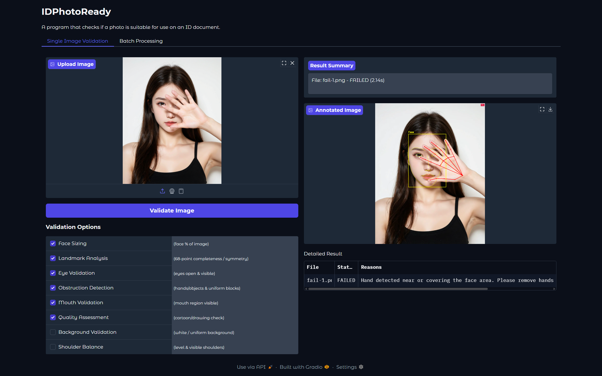
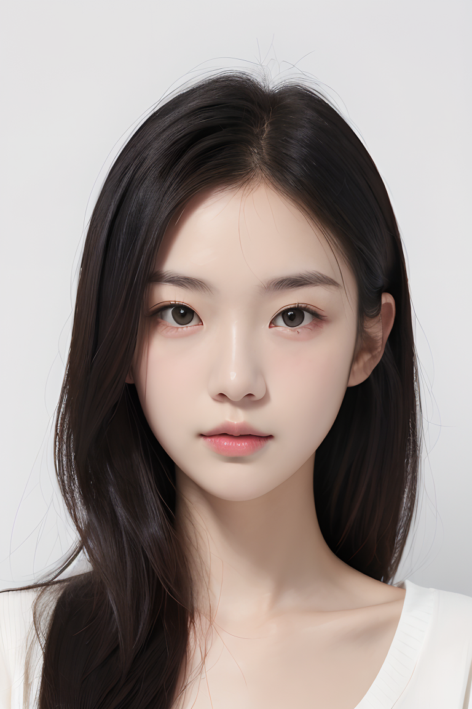
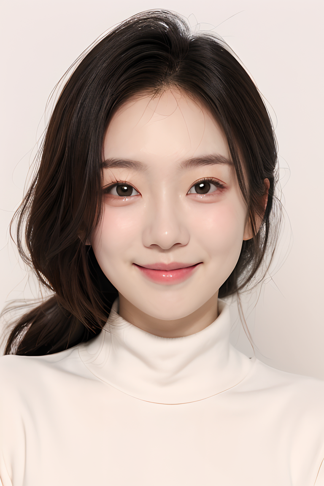
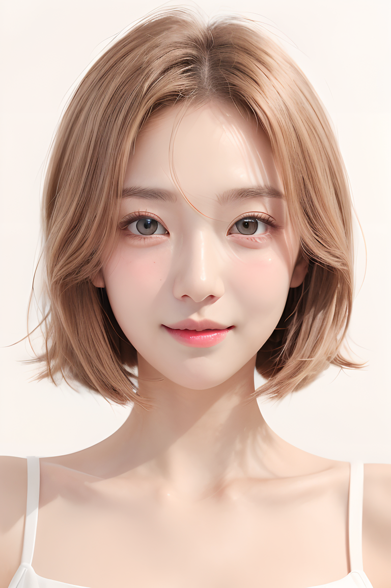
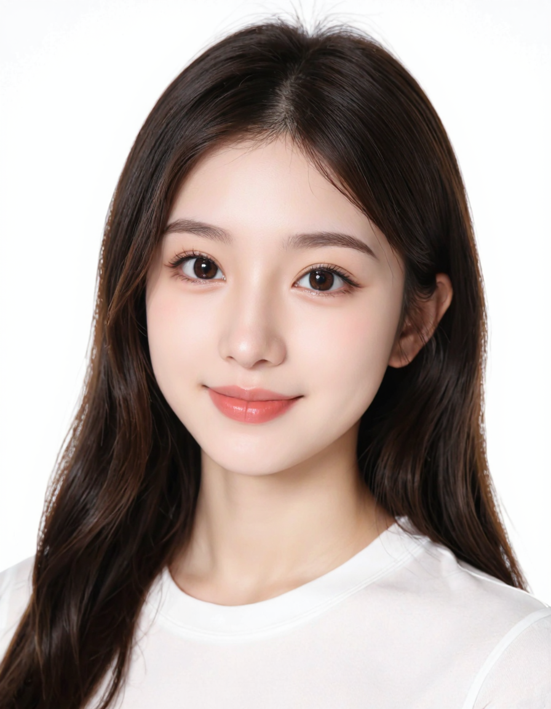
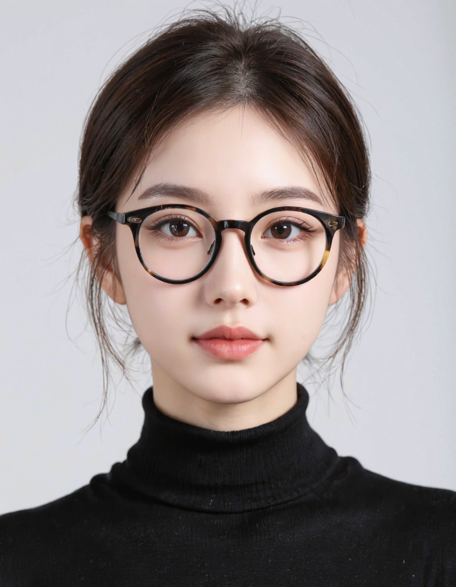
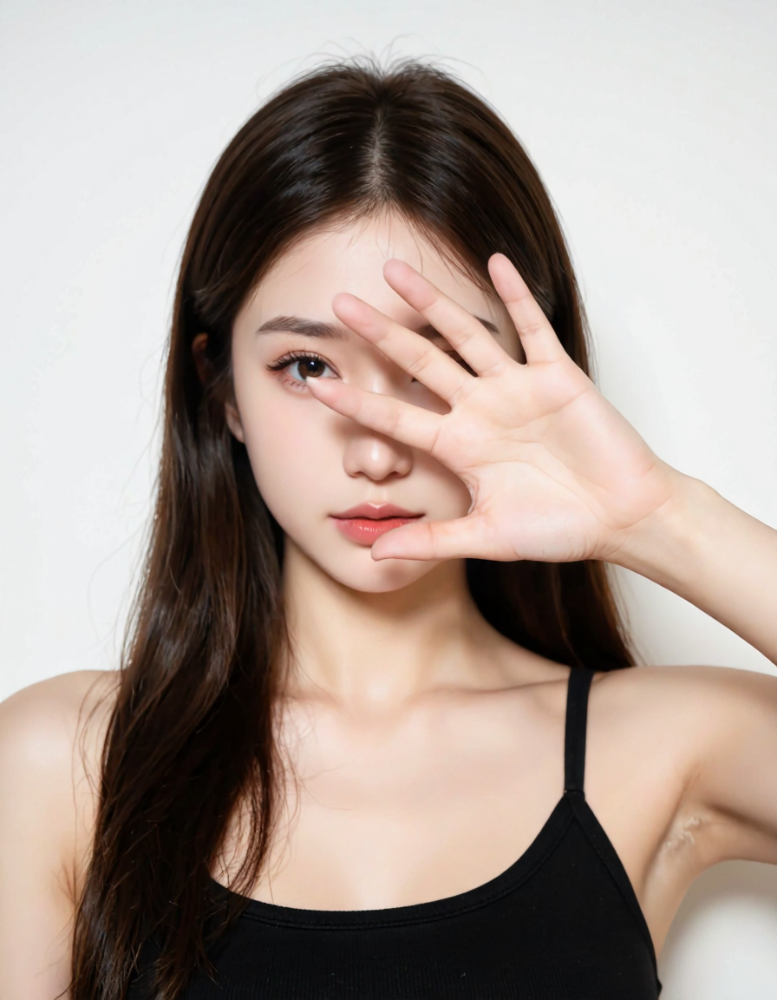
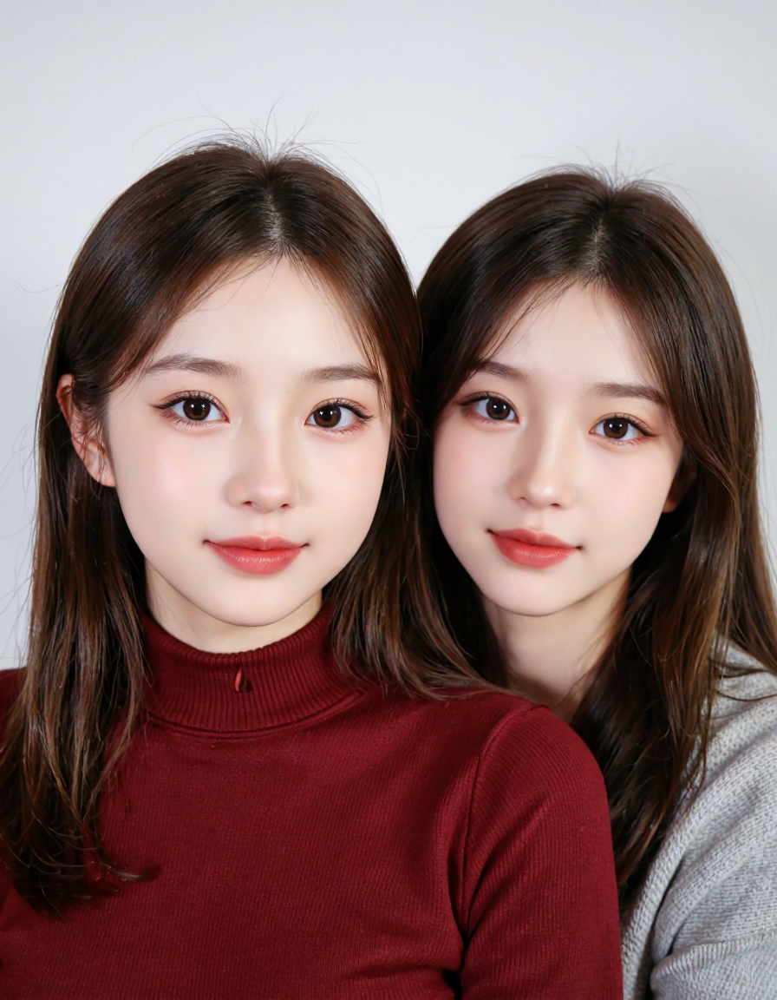
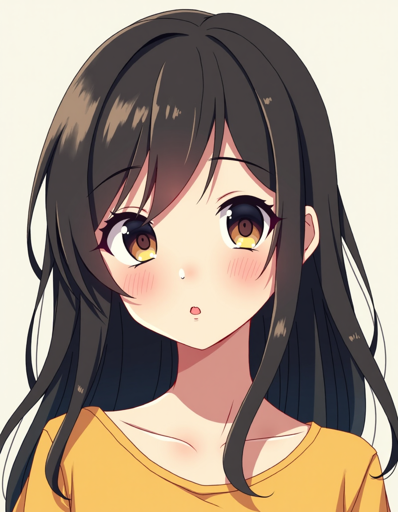
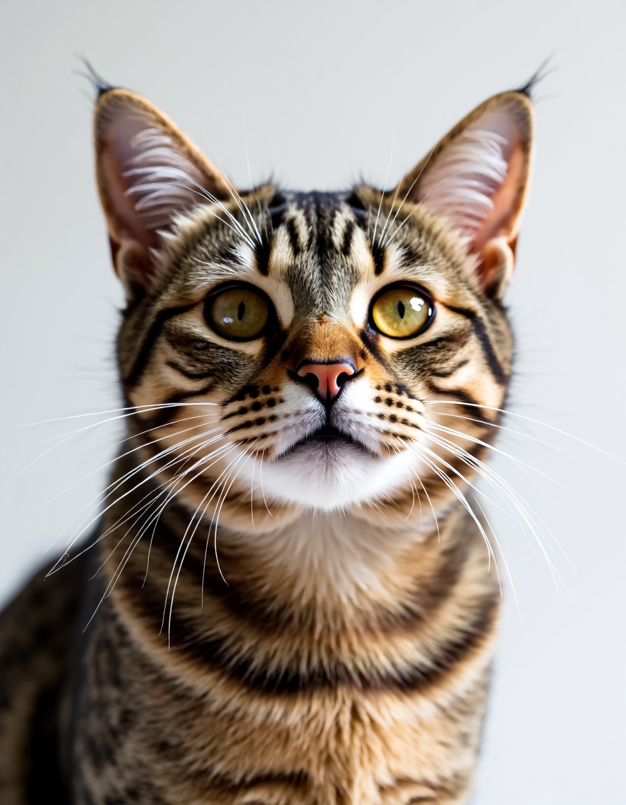

# IDPhotoReady

一個用來檢查照片是否適合用於身分證件的程式。

[English](README.md) | [繁體中文](README.zh-TW.md)



<details open>
<summary><strong>測試結果</strong></summary>

|                                                 圖片                                                 |                                                圖片                                                |                                                圖片                                                |                                                 圖片                                                 |
| :--------------------------------------------------------------------------------------------------: | :------------------------------------------------------------------------------------------------: | :------------------------------------------------------------------------------------------------: | :--------------------------------------------------------------------------------------------------: |
|         <div align="center"><br>結果：✅</div>         |        <div align="center"><br>結果：✅</div>        |        <div align="center"><br>結果：✅</div>        |         <div align="center"><br>結果：✅</div>         |
|         <div align="center"><br>結果：✅</div>         |        <div align="center"><br>結果：✅</div>        |        <div align="center"><br>結果：✅</div>        | <div align="center"><br>結果：❌（臉部被手遮擋）</div> |
| <div align="center"><br>結果：❌（臉部被手遮擋）</div> | <div align="center"><br>結果：❌（未正面朝向）</div> | <div align="center"><br>結果：❌（未正面朝向）</div> |    <div align="center"><br>結果：❌（兩張臉）</div>    |
|  <div align="center"><br>結果：❌（未正面朝向）</div>  |   <div align="center"><br>結果：❌（沒有臉）</div>   |   <div align="center"><br>結果：❌（沒有臉）</div>   |                                                                                                      |

</details>

## 📋 目錄

- [主要功能](#主要功能)
- [安裝](#安裝)
- [使用方式](#使用方式)
  - [Web 介面](#web-介面)
  - [REST API](#rest-api)
- [驗證選項](#驗證選項)
- [設定與調校](#設定與調校)
- [專案結構](#專案結構)
- [疑難排解](#疑難排解)
- [授權條款](#授權條款)

## ✨ 主要功能

- 🖥️ 雙介面：提供易用的 Web 介面（GUI）與 REST API，滿足個人使用與系統整合。
- ✅ 彈性驗證：可檢查臉部位置、眼睛開合、遮擋、背景一致性、肩膀平衡與影像品質。
- 🖼️ 標註結果：輸出清晰的標註圖，突顯偵測到的關鍵點與失敗原因。
- 🚀 強力建構：結合 OpenCV、MediaPipe 與 scikit-learn，提供準確且穩定的分析。

## ⚙️ 安裝

建議使用虛擬環境。

```bash
# 1. 下載專案
git clone https://github.com/askiichan/IDPhotoReady.git
cd IDPhotoReady

# 2. 建立並啟用虛擬環境
# 在 Windows
python -m venv venv
venv\Scripts\activate

# 在 macOS / Linux
python3 -m venv venv
source venv/bin/activate

# 3. 安裝相依套件
pip install -r requirements.txt
```

所需的 AI 模型會在首次執行時自動下載。若需手動下載，請參見[疑難排解](#疑難排解)。

## 🚀 使用方式

本專案可作為獨立的 Web 應用程式或後端 API 服務。

### 🖥️ Web 介面

最簡單的上手方式，適合驗證單張或少量照片。

1. 啟動應用程式：
   ```bash
   python main.py
   ```
2. 開啟瀏覽器並前往終端機顯示的本機網址（通常為 `http://127.0.0.1:7860`）。

介面會提供詳細的失敗原因與標註影像。

### 🔌 REST API

用於程式化存取與其他系統整合。

1. 啟動 API 伺服器：
   ```bash
   python start_api.py
   ```
2. 在瀏覽器開啟 `http://localhost:8000/docs` 以存取互動式文件，並可直接測試所有端點。

#### API 端點

- `POST /validate`：上傳影像檔進行驗證。
- `POST /validate-base64`：提交 base64 編碼影像字串。
- `GET /health`：檢查 API 是否運作中。

#### 範例：cURL

```bash
curl -X POST http://localhost:8000/validate \
  -H "Accept: application/json" \
  -F "file=@/path/to/photo.jpg;type=image/jpeg" \
  -F "return_annotated=true" \
  -F "validation_preset=custom" \
  -F "face_sizing=true" \
  -F "landmark_analysis=true" \
  -F "eye_validation=true" \
  -F "obstruction_detection=true" \
  -F "mouth_validation=true" \
  -F "quality_assessment=true" \
  -F "background_validation=true" \
  -F "shoulder_balance_validation=true"
```

## ✔️ 驗證選項

系統會進行一系列檢查，多數項目可開啟或關閉。

| 類別       | 檢查項目                                | 預設     |
| :--------- | :-------------------------------------- | :------- |
| 臉部偵測   | 偵測到且僅有一張臉，且信心值足夠。      | 永遠開啟 |
| 臉部大小   | 臉部面積合理（佔影像約 5–80%）。        | 開啟     |
| 關鍵點分析 | 68 個臉部關鍵點可見且位置合理。         | 開啟     |
| 眼睛驗證   | 以 EAR 判定雙眼為張開狀態。             | 開啟     |
| 遮擋偵測   | 臉部未被手、口罩或其他物體遮擋。        | 開啟     |
| 嘴巴驗證   | 嘴巴可見且未被不自然遮擋。              | 開啟     |
| 影像品質   | 非卡通/繪圖（以顏色與邊緣等特徵判定）。 | 開啟     |
| 背景       | 背景為均勻且中性（例如白色）。          | 關閉     |
| 肩膀平衡   | 肩膀可見、水平且取景恰當。              | 關閉     |

## 🔧 設定與調校

大部分行為由 `id_validator/config.py` 的常數與 `id_validator/validation_config.py` 的功能切換/預設所控制。

### 1. 功能開關／預設

執行期間可啟用/停用的類別（API 表單欄位／GUI 勾選）：
`face_sizing`, `landmark_analysis`, `eye_validation`, `obstruction_detection`, `mouth_validation`, `quality_assessment`, `background_validation`, `shoulder_balance_validation`。

### 2. 核心閾值（`config.py`）

臉部／偵測：

- `MIN_FACE_SIZE_RATIO` / `MAX_FACE_SIZE_RATIO`：可接受的臉部面積比例。若常誤判有效裁切過小/過大，可調整。
- `MIN_FACE_CONFIDENCE`：最小偵測信心值（提高以減少誤判，降低以處理困難影像）。

眼睛／關鍵點：

- `EAR_THRESHOLD`：低於此眼睛縱橫比視為閉眼。

遮擋與真實性（自然 vs 卡通／遮擋啟發式）：

- `MIN_SKIN_PERCENTAGE`：臉部 ROI 內最小皮膚像素比例。
- `MAX_UNIFORM_BLOCK_RATIO`：近似單一色塊在臉部區域所占最大比例。
- `UNIFORM_COLOR_STD_THRESHOLD`：判斷平坦區域的色彩標準差門檻。
- `MIN_EDGE_DENSITY`：邊緣密度過低可能表示遮擋或卡通。
- `MIN_COLOR_VARIANCE`：最低整體色彩變異度。
- `MAX_DARK_PIXEL_RATIO` / `MAX_BRIGHT_PIXEL_RATIO`：過暗/過亮比例過高代表曝光不佳或遮擋。
- `DARK_PIXEL_THRESHOLD` / `BRIGHT_PIXEL_THRESHOLD`：上述比例的亮度閾值。
- `CARTOON_THRESHOLD`：K-means 顏色叢集數（越低代表色彩更單純，較可疑）。

背景（均勻的中性背景）：

- `BG_SAMPLE_BORDER_PCT`：用於背景統計的邊框樣本厚度。
- `BG_MIN_MEAN_V`：最小亮度（HSV V 0–255）以視為足夠明亮。
- `BG_MAX_MEAN_S`：最大飽和度以視為中性。
- `BG_MAX_V_STD`：亮度變異度上限以視為背景均勻。

肩膀／上半身對齊：

- `SHOULDER_VISIBILITY_THRESHOLD`：每側肩膀的最小可見度（MediaPipe）。
- `MAX_SHOULDER_TILT_DEG`：允許的最大肩膀傾斜角（提高以降低嚴格度）。
- `MIN_SHOULDER_WIDTH_TO_FACE_RATIO`：確保取景包含肩膀寬度。

### 3. 何時調整

- 若常出現「臉太小／太大」：放寬 `MIN_FACE_SIZE_RATIO` 或收緊 `MAX_FACE_SIZE_RATIO`。
- 若張眼被誤判為閉眼：略微降低 `EAR_THRESHOLD`（例如 0.23）。
- 若卡通/合成圖通過過多：降低 `CARTOON_THRESHOLD` 或提高 `MIN_EDGE_DENSITY`。
- 若可接受的有色背景被拒：提高 `BG_MAX_MEAN_S` 或降低 `BG_MIN_MEAN_V`。
- 若肩膀傾斜誤判過多：將 `MAX_SHOULDER_TILT_DEG` 增加 1–2 度。

### 4. 安全編輯小技巧

一次只改一個變數，並記錄調整。若結果變差，盡快還原。可考慮未來加入 `config.local.py` 以覆寫設定。

## 📂 專案結構

```
.
├── main.py               # Gradio Web GUI 進入點
├── api.py                # FastAPI 伺服器進入點
├── requirements.txt      # 相依套件
├── id_validator/         # 核心程式庫
│   ├── validator.py      # 驗證流程
│   ├── config.py         # 閾值與常數
│   ├── validation_config.py  # 功能預設組合
│   ├── models.py         # Pydantic 模型
│   └── gradio_gui.py     # GUI 連線
├── models/               # 下載的模型權重
└── test_imgs/            # 範例影像
```

## 🚑 疑難排解

若機器學習模型未自動下載，請先檢查網路連線。也可由下列連結手動下載並放置於 `models/` 目錄：

- [deploy.prototxt](https://raw.githubusercontent.com/opencv/opencv/master/samples/dnn/face_detector/deploy.prototxt)
- [res10_300x300_ssd_iter_140000.caffemodel](https://raw.githubusercontent.com/opencv/opencv_3rdparty/dnn_samples_face_detector_20170830/res10_300x300_ssd_iter_140000.caffemodel)
- [lbfmodel.yaml](https://github.com/spmallick/GSOC2017/raw/master/data/lbfmodel.yaml)

## 📄 授權條款

本專案以 MIT 授權釋出，詳見 [LICENSE](LICENSE)。

聲明：本工具僅供教育與開發用途。若需正式用途，請確保符合當地法規。
